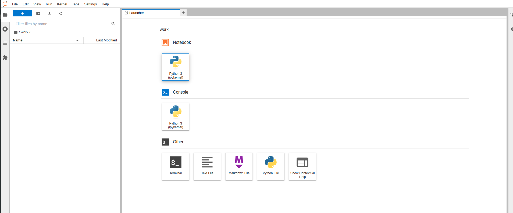

# pyspark-notebook
Jupyter Notebook and PySpark

## Run
To run the Jupyter Notebook environment with PySpark, follow these steps:

1. Clone the repository:
   ```
   git clone https://github.com/rfpompeu/pyspark-notebook.git
   ```

2. Navigate to the cloned directory:
   ```
   cd pyspark-notebook
   ```

3. Build the Docker image:
   ```
   docker build -t pyspark-notebook .
   ```

4. Run the Docker container:
   ```
   docker run -p 8888:8888 -u jovyan -v ${PWD}/notebooks:/home/jovyan/work pyspark-notebook
   ```

Running the above command will start the Docker container, and you can access the Jupyter Notebook in your browser using port 8888.



